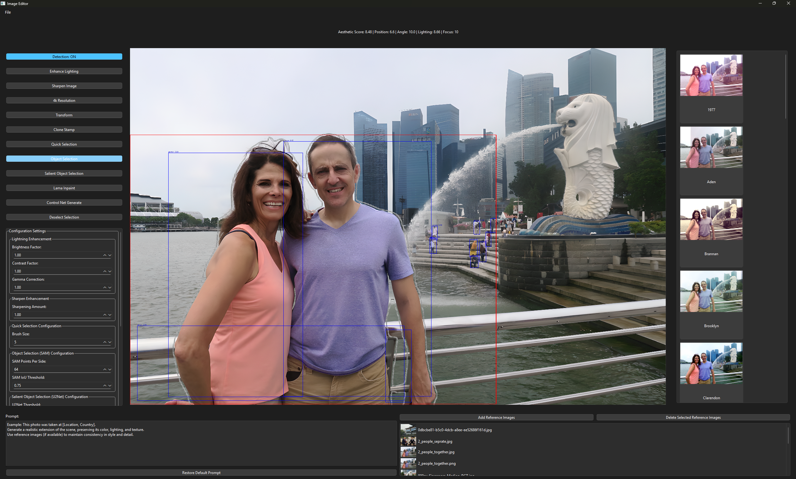

# AI Image Editor



## Introduction
AI Image Editor is an intuitive application leveraging state-of-the-art AI models to enable advanced image editing functionalities like human segmentation, AI-powered inpainting, aesthetic scoring, and realism scoring in a user-friendly interface built with Python and PyQt.

## Installation

To get started, first install the required dependencies:

```bash
pip install torch torchvision torchaudio --index-url https://download.pytorch.org/whl/cu126
pip install opencv-python numpy onnxruntime-gpu PyQt6 ultralytics diffusers realesrgan
pip install simple-lama-inpainting
```

## Special Requirements
- **Segment Anything Model (SAM)** needs to be installed separately from their [GitHub repository](https://github.com/facebookresearch/segment-anything).
- Ensure that your environment supports GPU for PyTorch and ONNXRuntime.

## Model Files
Download necessary AI model files from the following link:

[📥 Download Models](https://drive.google.com/file/d/1eAkHmECybleSKRHGUeW18ffv8KV4AFXA/view?usp=sharing)

Extract and place these model files in the appropriate directory as specified in the application documentation.

## GPU Support
This application requires GPU support for optimal performance, especially for:
- **torch**
- **onnxruntime-gpu**

Ensure your environment supports CUDA before installation.

## Features
- 4K resolution enhancement using **RealESRGAN**
- AI-powered object extraction using **U2Net** and **SAM**
- Advanced AI-powered inpainting using **LaMa** and **ControlNet**
- Lighting adjustments, such as brightness, shadows, or contrast with **OpenCV**
- Photo filters powered by Pillgram
- Real-time guidance and suggestions for improving photo quality (e.g., optimal positioning of the main subject)

## Credit


